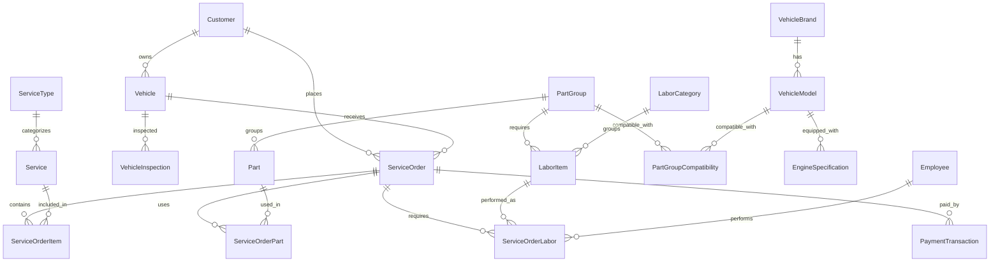

# TÀI LIỆU KỸ THUẬT - HỆ THỐNG QUẢN LÝ GARAGE Ô TÔ

## 📋 MỤC LỤC
1. [Tổng quan hệ thống](#tổng-quan-hệ-thống)
2. [Kiến trúc hệ thống](#kiến-trúc-hệ-thống)
3. [Cơ sở dữ liệu](#cơ-sở-dữ-liệu)
4. [API Documentation](#api-documentation)
5. [Bảo mật](#bảo-mật)
6. [Triển khai](#triển-khai)

---

## 🎯 TỔNG QUAN HỆ THỐNG

### **Mục đích**
Hệ thống quản lý garage ô tô toàn diện, hỗ trợ quản lý phụ tùng, dịch vụ sửa chữa, nhân viên và khách hàng.

### **Tính năng chính**
- ✅ Quản lý khách hàng và xe
- ✅ Quản lý phụ tùng và tồn kho
- ✅ Quản lý dịch vụ sửa chữa
- ✅ Quản lý nhân viên và phân quyền
- ✅ Báo giá và đơn hàng
- ✅ Thanh toán và báo cáo
- ✅ Phiếu nhập hàng với quản lý VAT
- ✅ Phiếu thu/chi (Financial Transactions)
- ✅ Dashboard Analytics
- ✅ Responsive Design cho tất cả views

### **Công nghệ sử dụng**
- **Backend**: ASP.NET Core 8.0 (.NET 8.0)
- **Database**: MySQL 8.0.21
- **Frontend**: HTML5, CSS3, JavaScript (jQuery)
- **Authentication**: IdentityServer4
- **ORM**: Entity Framework Core 8.0
- **API Documentation**: Swagger/OpenAPI
- **Caching**: IMemoryCache
- **Background Jobs**: IHostedService

---

## 🏗️ KIẾN TRÚC HỆ THỐNG

### **Kiến trúc tổng thể**
```
┌─────────────────┐    ┌─────────────────┐    ┌─────────────────┐
│   Web Client    │    │  Mobile Client  │    │   Admin Panel   │
└─────────────────┘    └─────────────────┘    └─────────────────┘
         │                       │                       │
         └───────────────────────┼───────────────────────┘
                                 │
                    ┌─────────────────┐
                    │   API Gateway   │
                    │ (IdentityServer)│
                    └─────────────────┘
                                 │
         ┌───────────────────────┼───────────────────────┐
         │                       │                       │
┌─────────────────┐    ┌─────────────────┐    ┌─────────────────┐
│  Web API        │    │  Identity API   │    │  Background     │
│ (Business Logic)│    │ (Authentication)│    │  Services       │
└─────────────────┘    └─────────────────┘    └─────────────────┘
         │                       │                       │
         └───────────────────────┼───────────────────────┘
                                 │
                    ┌─────────────────┐
                    │   MySQL 8.0     │
                    │   Database      │
                    └─────────────────┘
```

### **Cấu trúc dự án**
```
GaraManager/
├── src/
│   ├── GarageManagementSystem.API/          # Web API
│   ├── GarageManagementSystem.Core/         # Business Logic & Entities
│   ├── GarageManagementSystem.Infrastructure/ # Data Access Layer
│   ├── GarageManagementSystem.IdentityServer/ # Authentication
│   └── GarageManagementSystem.Web/          # Web Frontend
├── docs/                                    # Documentation
└── tests/                                   # Unit Tests
```

---

## 🗄️ CƠ SỞ DỮ LIỆU

### **Entity Relationship Diagram**


### **Bảng chính**

#### **1. Quản lý Khách hàng & Xe**
- `Customers`: Thông tin khách hàng
- `Vehicles`: Thông tin xe
- `VehicleBrands`: Hãng xe (Mercedes, BMW, Toyota...)
- `VehicleModels`: Model xe (C-Class, 3 Series, Camry...)
- `EngineSpecifications`: Thông số động cơ

#### **2. Quản lý Phụ tùng**
- `PartGroups`: Nhóm phụ tùng (Bộ lọc gió, Dầu động cơ...)
- `Parts`: Phụ tùng cụ thể
- `PartGroupCompatibilities`: Tương thích phụ tùng với xe
- `StockTransactions`: Giao dịch kho

#### **3. Quản lý Dịch vụ**
- `ServiceTypes`: Loại dịch vụ (Thay thế, Sửa chữa, Sơn...)
- `Services`: Dịch vụ cụ thể
- `LaborCategories`: Danh mục công lao động
- `LaborItems`: Chi tiết công lao động

#### **4. Quản lý Đơn hàng**
- `ServiceOrders`: Đơn hàng sửa chữa
- `ServiceOrderItems`: Chi tiết dịch vụ
- `ServiceOrderParts`: Chi tiết phụ tùng
- `ServiceOrderLabor`: Chi tiết công lao động

#### **5. Quản lý Nhân viên**
- `Employees`: Thông tin nhân viên
- `Departments`: Phòng ban
- `Positions`: Chức vụ

#### **6. Quản lý Thanh toán**
- `PaymentTransactions`: Giao dịch thanh toán
- `ServiceQuotations`: Báo giá dịch vụ
- `QuotationItems`: Chi tiết báo giá

#### **7. Quản lý Tài chính**
- `FinancialTransactions`: Giao dịch tài chính (Thu/Chi)
- `FinancialTransactionAttachments`: File đính kèm giao dịch

#### **8. Quản lý Nhập xuất tồn**
- `StockTransactions`: Giao dịch kho (Nhập/Xuất/Điều chỉnh)
- `Suppliers`: Nhà cung cấp phụ tùng
- `PurchaseOrders`: Đơn đặt hàng phụ tùng
- `PurchaseOrderItems`: Chi tiết đơn đặt hàng
- `PartSuppliers`: Phụ tùng từ nhà cung cấp

---

## 🔌 API DOCUMENTATION

### **Base URL**
```
Production: https://api.garamanager.com
Development: https://localhost:7001
```

### **Authentication**
Tất cả API đều yêu cầu Bearer Token:
```http
Authorization: Bearer {access_token}
```

### **Endpoints chính**

#### **1. Customer Management**
```http
GET    /api/customers              # Lấy danh sách khách hàng
POST   /api/customers              # Tạo khách hàng mới
GET    /api/customers/{id}         # Lấy thông tin khách hàng
PUT    /api/customers/{id}         # Cập nhật khách hàng
DELETE /api/customers/{id}         # Xóa khách hàng
```

#### **2. Vehicle Management**
```http
GET    /api/vehicles               # Lấy danh sách xe
POST   /api/vehicles               # Đăng ký xe mới
GET    /api/vehicles/{id}          # Lấy thông tin xe
PUT    /api/vehicles/{id}          # Cập nhật thông tin xe
```

#### **3. Parts Management**
```http
GET    /api/parts                  # Lấy danh sách phụ tùng
POST   /api/parts                  # Thêm phụ tùng mới
GET    /api/parts/{id}             # Lấy thông tin phụ tùng
PUT    /api/parts/{id}             # Cập nhật phụ tùng
GET    /api/parts/compatible/{vehicleId} # Phụ tùng tương thích
```

#### **4. Service Orders**
```http
GET    /api/serviceorders          # Lấy danh sách đơn hàng
POST   /api/serviceorders          # Tạo đơn hàng mới
GET    /api/serviceorders/{id}     # Lấy thông tin đơn hàng
PUT    /api/serviceorders/{id}     # Cập nhật đơn hàng
POST   /api/serviceorders/{id}/complete # Hoàn thành đơn hàng
```

#### **5. Financial Management**
```http
GET    /api/financial-transactions # Lấy danh sách giao dịch tài chính
POST   /api/financial-transactions # Tạo giao dịch tài chính
GET    /api/financial-transactions/{id} # Lấy thông tin giao dịch
PUT    /api/financial-transactions/{id} # Cập nhật giao dịch
GET    /api/financial-reports/income # Báo cáo thu nhập
GET    /api/financial-reports/expense # Báo cáo chi phí
```

#### **6. Stock Management**
```http
GET    /api/stock-transactions     # Lấy danh sách giao dịch kho
POST   /api/stock-transactions     # Tạo giao dịch kho
GET    /api/stock-transactions/{id} # Lấy thông tin giao dịch
PUT    /api/stock-transactions/{id} # Cập nhật giao dịch
GET    /api/stock-reports/inventory # Báo cáo tồn kho
GET    /api/stock-reports/movement # Báo cáo xuất nhập
```

#### **7. Supplier Management**
```http
GET    /api/suppliers              # Lấy danh sách nhà cung cấp
POST   /api/suppliers              # Tạo nhà cung cấp mới
GET    /api/suppliers/{id}         # Lấy thông tin nhà cung cấp
PUT    /api/suppliers/{id}         # Cập nhật nhà cung cấp
```

#### **8. Purchase Orders Management**
```http
GET    /api/purchaseorders                    # Lấy danh sách phiếu nhập
POST   /api/purchaseorders                    # Tạo phiếu nhập mới
GET    /api/purchaseorders/{orderNumber}       # Lấy phiếu nhập theo số phiếu
GET    /api/purchaseorders/{id}                # Lấy phiếu nhập theo ID
PUT    /api/purchaseorders/{id}                # Cập nhật phiếu nhập
DELETE /api/purchaseorders/{id}                # Xóa phiếu nhập
POST   /api/purchaseorders/{id}/send          # Gửi phiếu nhập
POST   /api/purchaseorders/{id}/cancel        # Hủy phiếu nhập
POST   /api/purchaseorders/{id}/receive       # Nhận hàng (tạo stock + financial)
```

#### **9. Financial Transactions Management**
```http
GET    /api/financialtransactions             # Lấy danh sách phiếu thu/chi
GET    /api/financialtransactions/categories  # Lấy danh sách categories
POST   /api/financialtransactions             # Tạo phiếu thu/chi
GET    /api/financialtransactions/{id}        # Lấy chi tiết phiếu thu/chi
PUT    /api/financialtransactions/{id}        # Cập nhật phiếu thu/chi
DELETE /api/financialtransactions/{id}        # Xóa phiếu thu/chi
```

#### **10. Dashboard & Analytics**
```http
GET    /api/analytics/dashboard               # Lấy thống kê dashboard
GET    /api/analytics/parts-turnover          # Phân tích vòng quay phụ tùng
GET    /api/analytics/completion-time          # Phân tích thời gian hoàn thành
GET    /api/analytics/payment-methods         # Thống kê phương thức thanh toán
```

### **Response Format**
```json
{
  "success": true,
  "data": {},
  "message": "Operation completed successfully",
  "timestamp": "2024-01-01T00:00:00Z"
}
```

### **Error Response**
```json
{
  "success": false,
  "error": {
    "code": "VALIDATION_ERROR",
    "message": "Invalid input data",
    "details": ["Name is required", "Email format is invalid"]
  },
  "timestamp": "2024-01-01T00:00:00Z"
}
```

---

## 🔒 BẢO MẬT

### **Authentication Flow**
1. User đăng nhập qua IdentityServer
2. Nhận Access Token và Refresh Token
3. Sử dụng Access Token cho các API calls
4. Refresh Token khi Access Token hết hạn

### **Authorization Levels**
- **Admin**: Toàn quyền hệ thống
- **Manager**: Quản lý đơn hàng, báo cáo
- **Technician**: Thực hiện dịch vụ
- **Cashier**: Thanh toán, xuất hóa đơn
- **Viewer**: Chỉ xem thông tin

### **Data Protection**
- Mã hóa password bằng BCrypt
- HTTPS cho tất cả communications
- SQL Injection protection
- XSS protection
- CSRF protection

---

## 🚀 TRIỂN KHAI

### **Yêu cầu hệ thống**
- **OS**: Windows Server 2019+ hoặc Linux Ubuntu 20.04+
- **RAM**: Tối thiểu 4GB, khuyến nghị 8GB+
- **CPU**: 2 cores trở lên
- **Storage**: 50GB trở lên
- **Database**: MySQL 8.0+

### **Cài đặt Development**
```bash
# Clone repository
git clone https://github.com/your-repo/garamanager.git
cd garamanager

# Restore packages
dotnet restore

# Update database
dotnet ef database update

# Run applications
dotnet run --project src/GarageManagementSystem.IdentityServer
dotnet run --project src/GarageManagementSystem.API
dotnet run --project src/GarageManagementSystem.Web
```

### **Cài đặt Production**
```bash
# Build applications
dotnet publish -c Release

# Deploy to IIS (Windows) hoặc Nginx (Linux)
# Configure database connection strings
# Set up SSL certificates
# Configure firewall rules
```

### **Environment Variables**
```bash
ASPNETCORE_ENVIRONMENT=Production
ConnectionStrings__DefaultConnection="Server=...;Database=...;User=...;Password=..."
JWT__SecretKey="your-secret-key"
JWT__Issuer="https://your-domain.com"
JWT__Audience="https://your-domain.com"
```

### **Monitoring & Logging**
- Application Insights cho monitoring
- Serilog cho structured logging
- Health checks cho system status
- Performance counters

---

## 📊 PERFORMANCE

### **Benchmarks**
- **API Response Time**: < 200ms (95th percentile)
- **Database Query Time**: < 100ms (average)
- **Concurrent Users**: 100+ users
- **Data Throughput**: 1000+ requests/minute

### **Optimization**
- Entity Framework query optimization
- Database indexing
- Caching strategies
- Connection pooling
- Async/await patterns

---

## 🔧 MAINTENANCE

### **Backup Strategy**
- Daily automated database backups
- Weekly full system backups
- Point-in-time recovery capability

### **Update Process**
- Blue-green deployment
- Database migration scripts
- Rollback procedures
- Testing procedures

### **Monitoring**
- Application performance monitoring
- Error tracking và alerting
- Resource utilization monitoring
- User activity tracking

---

## 📞 SUPPORT

### **Contact Information**
- **Technical Support**: support@garamanager.com
- **Documentation**: docs.garamanager.com
- **Issue Tracker**: github.com/your-repo/garamanager/issues

### **Version History**
- **v1.0.0**: Initial release
- **v1.1.0**: Enhanced parts management
- **v1.2.0**: Advanced reporting features
- **v2.0.0**: Complete system redesign (Current)

---

*Tài liệu này được cập nhật thường xuyên. Phiên bản mới nhất: v2.0.0*
